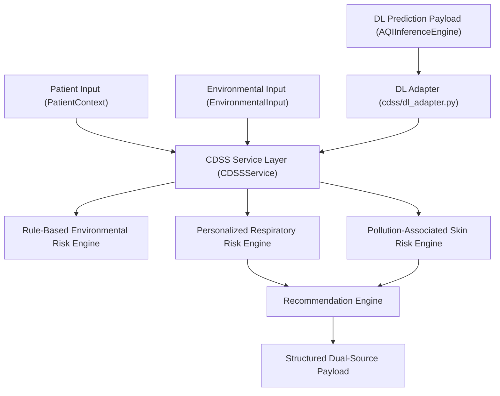

# AI-AQI Clinical Decision Support System (CDSS)

> [!IMPORTANT]
> **LEGAL & NON-DIAGNOSTIC DISCLAIMER**
> This system provides environmental health-risk information and preventive guidance. It does NOT diagnose disease, prescribe medications, alter medical treatments, or replace professional clinical judgment.
>
> *"The current CDSS is a prototype environmental health-risk support component. Its personalization rules are project-defined and are not clinically validated patient-risk coefficients."*

---

## 1. Purpose & Scope

The **Clinical Decision Support System (CDSS)** module in AI-AQI serves as an **Environmental Health-Risk Support Engine**. It synthesizes individual patient health context, ambient air pollution measurements, rule-based risk stratification, Deep Learning AQI model predictions, and preventive health recommendations into structured, actionable environmental risk assessments.

---

## 2. Architecture & Deep Learning Adapter Integration

The CDSS maintains a strict operational separation between ambient environmental risk classification, Deep Learning model forecasts, and individual health risk stratifications:



### Deep Learning Model Adapter (`cdss/dl_adapter.py`)
Validates raw predictions from `AQIInferenceEngine.predict_single()` and maps 5-class DL AQI risk levels into 3-tier CDSS environmental categories without modifying raw predictions:

| DL Risk Class | Raw DL Label | CDSS Mapped Category (`model_environmental_risk`) |
| :---: | :--- | :--- |
| `0` | **Low** | `"Low"` |
| `1` | **Moderate** | `"Moderate"` |
| `2` | **Unhealthy** | `"High"` |
| `3` | **Very Unhealthy** | `"High"` |
| `4` | **Severe** | `"High"` |

---

## 3. Preserved Raw DL Prediction Attributes

When a DL model prediction is supplied, the CDSS preserves:
- `model_risk_class` (0–4)
- `model_risk_label` (e.g. `"Very Unhealthy"`)
- `model_probabilities` (list of 5 floats)
- `applied_thresholds` ($[0.80, 1.00, 0.90, 0.75, 0.05]$)
- `model_version` (`"FINAL_OFFICIAL_DL_MODEL_v1.0"`)
- `model_environmental_risk` (`"High"`)

---

## 4. Payload Schema Specification

### Standalone Mode (No DL Model Prediction)
```json
{
  "environmental_risk": "High",
  "environmental_risk_index": 88,
  "environmental_contributors": ["PM2.5", "NO2"],
  "respiratory_environmental_risk": "High",
  "respiratory_contributors": ["PM2.5", "NO2", "Existing respiratory condition: asthma (moderate)"],
  "skin_environmental_risk": "High",
  "skin_contributors": ["PM2.5"],
  "patient_context_factors": ["Existing respiratory condition: asthma (moderate)"],
  "recommendations": ["..."],
  "disclaimer": "This system provides environmental health-risk information and preventive guidance. It does not diagnose disease or replace professional clinical judgment."
}
```

### Integrated Mode (DL Model Prediction Supplied)
```json
{
  "rule_based_environmental_risk": "Low",
  "environmental_risk_index": 28,
  "environmental_contributors": [],
  "model_risk_class": 3,
  "model_risk_label": "Very Unhealthy",
  "model_environmental_risk": "High",
  "model_probabilities": [0.02, 0.05, 0.13, 0.75, 0.05],
  "model_version": "FINAL_OFFICIAL_DL_MODEL_v1.0",
  "respiratory_environmental_risk": "High",
  "respiratory_contributors": ["Existing respiratory condition: asthma (moderate)"],
  "skin_environmental_risk": "Low",
  "skin_contributors": [],
  "patient_context_factors": ["Existing respiratory condition: asthma (moderate)"],
  "recommendations": ["..."],
  "disclaimer": "This system provides environmental health-risk information and preventive guidance. It does not diagnose disease or replace professional clinical judgment."
}
```

---

## 5. Automated Test Suite

- `tests/test_cdss.py`: 11 unit tests for CDSS rules, boundary thresholds, schema validation.
- `tests/test_dl_adapter.py`: 11 unit tests for 5-class mappings, validation error guards, and end-to-end `AQIInferenceEngine` integration.
- **Total Suite Execution**: 22/22 Passing cleanly in 0.001s.
