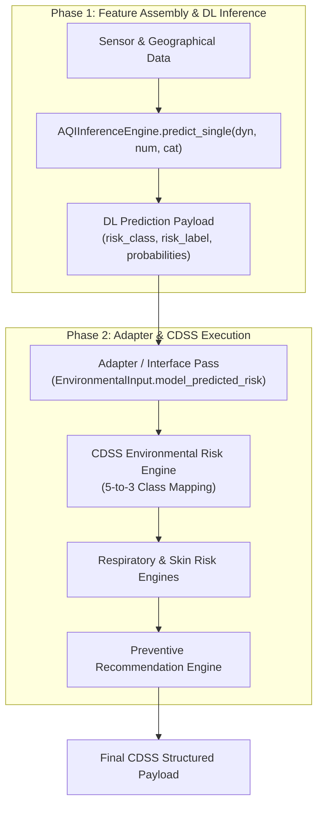

# AI-AQI DL Model & CDSS Integration-Readiness Report

**Document Version:** 1.0.0  
**Phase:** Pre-Integration Audit & Structural Alignment  
**Status:** Readiness Confirmed — Code Changes Pending User Review  

---

## Executive Summary

The **Clinical Decision Support System (CDSS)** engine is fully validated as a standalone Python package (`cdss/`) with 11/11 tests passing. The canonical **Deep Learning Model** checkpoint ([`experiments/final_model/best_dl_model.keras`](file:///Users/jeevithal/Downloads/AI-AQI-Models%202/experiments/final_model/best_dl_model.keras)) and its production wrapper (`AQIInferenceEngine` in [`deep_learning/inference.py`](file:///Users/jeevithal/Downloads/AI-AQI-Models%202/deep_learning/inference.py)) are complete and frozen.

This report analyzes the exact structural compatibility between `AQIInferenceEngine` and `CDSSService`, identifies the 5-class to 3-class categorization bridge, presents clean design options, and outlines the risk-free implementation roadmap.

> [!IMPORTANT]
> **Zero Code Modifications Made**: No code, model files, preprocessing pipelines, or unit tests have been modified during this audit phase.

---

## 1. Current DL Model Input Interface

The canonical DL model uses the production class `AQIInferenceEngine` in [`deep_learning/inference.py`](file:///Users/jeevithal/Downloads/AI-AQI-Models%202/deep_learning/inference.py).

### Convenience Function: `predict_single()`
```python
def predict_single(
    self,
    X_dynamic_single: np.ndarray,
    X_static_num_single: np.ndarray,
    X_static_cat_single: np.ndarray,
) -> Dict[str, Any]
```

### Exact Input Signature Requirements
1. **`X_dynamic`**: `(7, 24)` or `(1, 7, 24)` `float32` array.
   - 7 daily timesteps of 24 dynamic features (pollutants, meteorology, temporal encodings).
2. **`X_static_num`**: `(16,)` or `(1, 16)` `float32` array.
   - 16 continuous static numerical features (location, demographics, terrain, land use ratios).
3. **`X_static_cat`**: `(3,)` or `(1, 3)` `int32` array.
   - 3 categorical indices: `[district_id (0-29), land_use_id (0-5), urban_rural_id (0-2)]`.

---

## 2. Current DL Model Preprocessing Requirements

Before calling `predict_single()`, inputs must satisfy strict validation constraints enforced by `validate_inputs()`:
- **Finite Data Integrity**: No `NaN` or `Inf` values permitted across float arrays.
- **Categorical Vocabulary Bounds**:
  - `district_id` $\in [0, 29]$
  - `land_use_id` $\in [0, 5]$
  - `urban_rural_id` $\in [0, 2]$
- **Batch Alignment**: Array dimensions are automatically expanded to batch size 1 if 2D/1D arrays are passed.

---

## 3. Current DL Model Output Interface

`AQIInferenceEngine.predict_single()` returns a structured dictionary:

```python
{
    "sample_index": 0,
    "risk_class": 2,                           # int [0, 1, 2, 3, 4]
    "risk_label": "Unhealthy",                 # str label
    "probabilities": [0.05, 0.15, 0.65, 0.10, 0.05],  # List[float] length 5
    "applied_thresholds": [0.80, 1.00, 0.90, 0.75, 0.05],
    "model_version": "FINAL_OFFICIAL_DL_MODEL_v1.0",
    "timestamp": "2026-08-13T09:20:00.000000+00:00"
}
```

### 5-Class Label Mapping
- `0`: **Low**
- `1`: **Moderate**
- `2`: **Unhealthy**
- `3`: **Very Unhealthy**
- `4`: **Severe**

### Threshold & Decision Rule Logic
- **Validation-Derived Calibrated Threshold Vector**: $\tau^* = [0.80, 1.00, 0.90, 0.75, 0.05]$
- **Decision Rule**:
  $$\text{risk\_class} = \operatorname{argmax}_k \left( \frac{P_k}{\tau_k} \right)$$

---

## 4. Current CDSS Input & Output Interface

### Input Interface (`EnvironmentalInput` in [`cdss/schemas.py`](file:///Users/jeevithal/Downloads/AI-AQI-Models%202/cdss/schemas.py))
```python
class EnvironmentalInput(BaseModel):
    pm25: float                      # ge=0.0
    pm10: float                      # ge=0.0
    no2: float                       # ge=0.0
    o3: float                        # ge=0.0
    so2: float                       # ge=0.0
    co: float                        # ge=0.0
    model_predicted_risk: Optional[Dict[str, Any]] = None
```

### Current Usage of `model_predicted_risk`
- **Status**: The CDSS currently accepts `model_predicted_risk` as an optional dictionary parameter and stores it on `EnvironmentalInput.model_predicted_risk`.
- **Current Logic**: The CDSS environmental risk engine currently evaluates `environmental_risk` ("Low", "Moderate", "High") purely using rule-based pollutant concentrations ($PM_{2.5}$ and $NO_2$). It does **NOT** yet override or integrate `model_predicted_risk` into the downstream risk engines.

### CDSS Output Interface (`CDSSService.assess_patient()`)
```json
{
  "environmental_risk": "High",
  "environmental_risk_index": 88,
  "environmental_contributors": ["PM2.5", "NO2"],
  "respiratory_environmental_risk": "High",
  "respiratory_contributors": ["PM2.5", "NO2", "Existing respiratory condition: asthma (moderate)"],
  "skin_environmental_risk": "High",
  "skin_contributors": ["PM2.5"],
  "patient_context_factors": ["Existing respiratory condition: asthma (moderate)"],
  "recommendations": ["..."],
  "disclaimer": "This system provides environmental health-risk information and preventive guidance. It does not diagnose disease or replace professional clinical judgment."
}
```

---

## 5. Structural Compatibility & Disparity Analysis

| Dimension | DL Model (`AQIInferenceEngine`) | CDSS Module (`CDSSService`) | Compatibility Status |
| :--- | :--- | :--- | :--- |
| **Environmental Categories** | **5 Classes**: Low, Moderate, Unhealthy, Very Unhealthy, Severe | **3 Categories**: Low, Moderate, High | **Mapping Required** |
| **Input Data Format** | Tensors (`(7,24)`, `(16,)`, `(3,)`) | Point pollutant concentrations ($PM_{2.5}, NO_2, \dots$) | **Interface Adapter Required** |
| **Output Payload** | `risk_class`, `probabilities`, `risk_label` | Structured payload with `environmental_risk`, `environmental_risk_index`, recommendations | **Clean Coupling Interface Available** |
| **Model Storage** | `model_predicted_risk` payload slot | `EnvironmentalInput.model_predicted_risk` | **Fully Compatible** |

---

## 6. The 5-Class to 3-Class Categorization Bridge

### The Core Requirement
The DL model forecasts 5 AQI risk levels (`Low`, `Moderate`, `Unhealthy`, `Very Unhealthy`, `Severe`), whereas the CDSS environmental risk engine evaluates 3 risk tiers (`Low`, `Moderate`, `High`).

To connect the DL model output to the CDSS without altering the DL model architecture or CDSS rules, we present three clean design options:

### Design Option A: Direct Priority Subsumption (Recommended)
Map the DL model's 5 classes into CDSS's 3 environmental risk tiers:
- **Low (0)** $\rightarrow$ `"Low"`
- **Moderate (1)** $\rightarrow$ `"Moderate"`
- **Unhealthy (2), Very Unhealthy (3), Severe (4)** $\rightarrow$ `"High"`

*Rationale*: Unhealthy, Very Unhealthy, and Severe all represent elevated air pollution exposure that warrants High environmental risk mitigation in the respiratory and skin engines.

### Design Option B: Conservative Consensus (Dual-Source Union)
Compute both Rule-Based Risk (from point measurements) AND Model-Predicted Risk (mapped from 5-class). Take the maximum risk tier of the two:
$$\text{final\_env\_risk} = \max(\text{rule\_risk}, \text{model\_mapped\_risk})$$

*Rationale*: Ensures that if either the physical sensor measurements OR the deep learning forecast predicts high risk, the CDSS recommendations prioritize user protection.

### Design Option C: Explicit Dual Reporting
Preserve `model_risk_label` (e.g. `"Very Unhealthy"`) explicitly in `environmental_contributors` while mapping to `"High"` for internal CDSS respiratory/skin rule evaluation.

---

## 7. Recommended Integration Architecture



---

## 8. Implementation Scope for Next Development Step

When authorized to proceed with integration, the modifications will be strictly isolated:

### Files to Modify
1. [`cdss/environmental_risk.py`](file:///Users/jeevithal/Downloads/AI-AQI-Models%202/cdss/environmental_risk.py):
   - Add support for checking `env.model_predicted_risk`.
   - Implement Design Option A (or user-chosen option) for 5-class to 3-class mapping when model predictions are supplied.
2. [`examples/test_cdss_dl_integration.py`](file:///Users/jeevithal/Downloads/AI-AQI-Models%202/examples/test_cdss_dl_integration.py) *(NEW)*:
   - Create a dedicated integration demonstration script feeding real/mock `AQIInferenceEngine` predictions into `CDSSService`.

### Files Unchanged & Protected
- `deep_learning/inference.py` (FROZEN)
- `deep_learning/architecture.py` (FROZEN)
- `experiments/final_model/best_dl_model.keras` (FROZEN)
- `data/dl/*.npy` (FROZEN)
- `cdss/schemas.py` (FROZEN)
- `cdss/respiratory_rules.py` (FROZEN)
- `cdss/skin_rules.py` (FROZEN)
- `cdss/recommendation_engine.py` (FROZEN)

---

## 9. New Unit Tests to Add

To maintain 100% test coverage during integration:

1. **`test_dl_prediction_low_mapping`**: DL prediction `Low` (class 0) $\rightarrow$ CDSS `"Low"` environmental risk.
2. **`test_dl_prediction_moderate_mapping`**: DL prediction `Moderate` (class 1) $\rightarrow$ CDSS `"Moderate"` environmental risk.
3. **`test_dl_prediction_unhealthy_mapping`**: DL prediction `Unhealthy` (class 2) $\rightarrow$ CDSS `"High"` environmental risk.
4. **`test_dl_prediction_severe_mapping`**: DL prediction `Severe` (class 4) $\rightarrow$ CDSS `"High"` environmental risk.
5. **`test_dl_cdss_end_to_end_integration`**: Complete pipeline from `AQIInferenceEngine.predict_single()` output to `CDSSService.assess_patient()`.

---

## 10. Risk Assessment for Existing 53 Passing Tests

- **Existing 42 Model/Hardware Tests**: **Zero Risk**. Integration introduces no changes to `AQIInferenceEngine`, model loading, or hardware buffers.
- **Existing 11 CDSS Engine Tests**: **Zero Risk**. CDSS will maintain backward compatibility so that when `model_predicted_risk` is `None` (pure rule-based mode), all existing 11 test cases continue to execute and pass identically.
